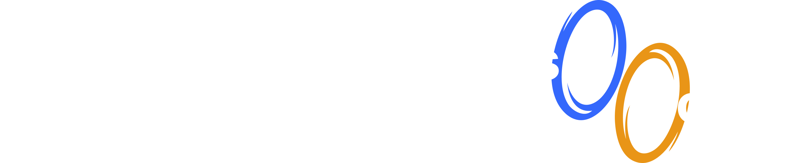

<p align="center">
  <a  href="https://github.com/pedrobslisboa/universal-portal#gh-light-mode-only">
    
  </a>

  <a  href="https://github.com/pedrobslisboa/universal-portal#gh-dark-mode-only">
    
  </a>
</p>

## Universal Reason Portal

Universal Portal for ssr natively ReasonReact apps.

This project was inspired by [server-reason-react](https://github.com/ml-in-barcelona/server-reason-react) to understand how SSR with ReasonReact works and also give the community more material to learn about SSR with ReasonReact.

## Table of Contents

- [Installation](#installation)
- [Usage](#usage)
  - [Server](#server)
  - [Shared](#shared)
- [Running the demo](#running-the-demo)

## Installation

```sh
opam pin add universal-portal.dev "https://github.com/pedrobslisboa/universal-portal#main"
```

## Usage

### Server

```reason
  Dream.router([
    Dream.get("/", _request => {
      let portals: ref(array(UniversalPortal_Shared.portal)) = ref([||]);

      let element =
        ReactDOM.renderToString(
          UniversalPortal_Server.collectPortals(
            <Page scripts=["/static/app.js"]>
              <Shared_native_demo.App />
            </Page>,
            (collectedPortal: UniversalPortal_Shared.portal) => {
            portals := Array.append(portals^, [|collectedPortal|])
          }),
        );

      let html =
        UniversalPortal_Server.appendUniversalPortals(element, portals^);

      portals := [||];

      html |> Dream.html;
    }),
    Dream.get("/static/**", Dream.static("./static")),
  ]);
```

### Shared

#### For client dune config add

```dune
 (libraries universal-portal.shared_js)
```

#### For native dune config add

```dune
 (libraries universal-portal.shared_native)
```

#### Component

Use `UniversalPortal_Shared` and it will work on both client and native content.

```reason
[@react.component]
let make = () => {
  <div>
    <UniversalPortal_Shared.Portal selector="body">
      <div>
        {"Hey, I'm a portal, disable JS on your dev tools and check that I'll still here"
          |> React.string}
      </div>
    </UniversalPortal_Shared.Portal>
  </div>;
};
```

#### Cleaning server side portals

You must call the `UniversalPortal_Shared.removeServerPortals` at the main entry point of your app, so it will remove all the server side portals.

Checkout the demo for more details: [Demo](/demo/shared/native/App.re#L3-L9)

```reason
  React.useEffect1(
    () => {
      UniversalPortal_Shared.removeServerPortals();

      None;
    },
    [||],
  );
```

## Running the demo

Make sure to initialize the project:

```sh
make init
```

Then you can run the demo:

```sh
make demo
```

## Roadmap

- [ ] Improve tests